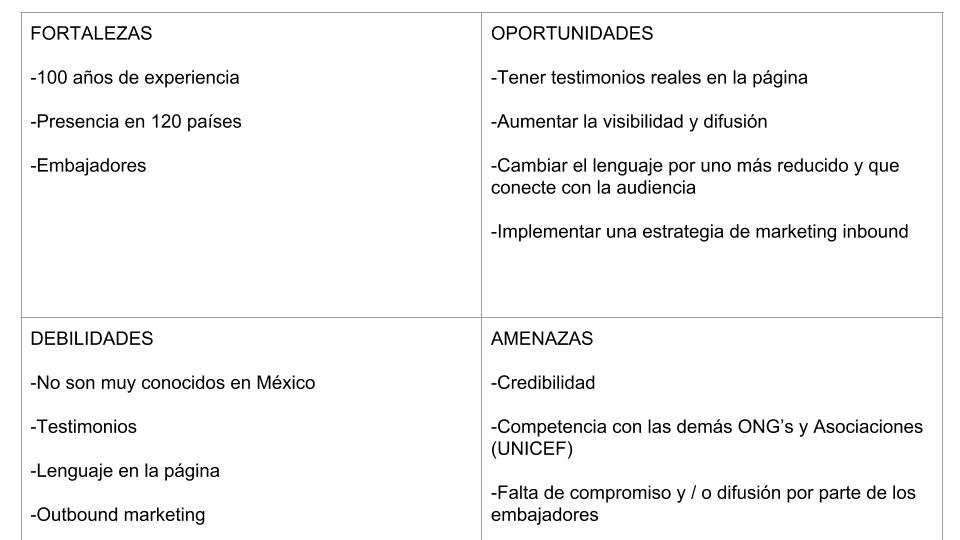

# Save the Children

## EL problema
Save the Children cuenta con un grant de Google Adwords con el cual dirigimos tráfico a una página de que tiene como finalidad generar donantes recurrentes

* Sólo el .5% de visitas se convierte en lead
* EL 15% de los leads se convierte en donante

## Fases del proceso

Explorando los negocios:
Se realizó un modelo canvas de la ONG a fin de conocer el modelo de negocio así como el Análisis FODA del mismo:

