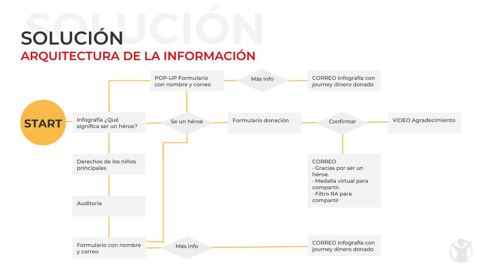

# Save the Children


Aumentar el número de donantes recurrentes a través del grant de Google Adwords

## Equipo:
- Lía Laguna
- Jocelyn Esquivel
- Jessica Cuevas
- Karina Mosqueda
- Anett Trujillo
- Gabriela Colín (UX-Research)

## Fases del proceso


## Research


Seleccionamos una serie de personas que fueron entrevistadas de forma individual para conocer su opinión sobre la página así como sus reacciones. Con este tipo de investigación pudimos medir y analizar su actitud y satisfacción durante el journey de donación.


```
Insights:
- 6 de cada 10 usuarios sólo lee titulos y subtítulos
- La sensación generada es de impotencia en un 40% y 20% de tristeza
- 80% siente desconfianza al dejar sus datos
```

## Solución propuesta:

Se mantuvieron los colores y la tipografía establecidos por Save the Children con el fin de conservar la identidad visual que caracteriza la marca



## Primer testing

El prototipo planteado como la solución fue testeado por primera vez

Insights:
- 57% sintió ganas de ayudar
- 80% prefiere no dejar su número telefónico
- 60% cancelaría el cargo mensual si no es de su agrado el servicio y la información

## Segundo testing

El prototipo recibió feedback para modificar aún más el tono rojo pues continuaba pareciéndole muy agresivo

Insights:

- 67.7% le genera un sentimiento de solidaridad
- 75% siente que la página motiva a la donación
- 60% volvería a donar pues les genera satisfacción ser un héroe

## Beneficios de la solución propuesta

Al cambiar el tono de comunicación, el público genera un sentimiento de solidaridad en un 83%, lo que nos permite generar un engagement con los usuarios.
Los colores ahora generan un sentimiento de cooperación y lo relacionan con la cruz roja.


